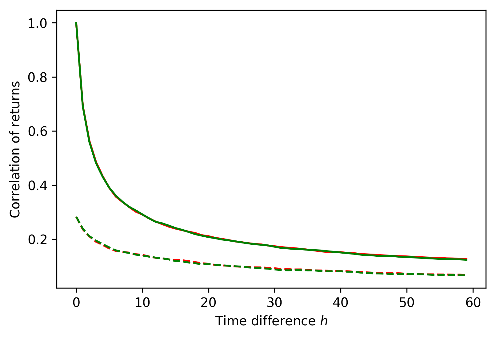
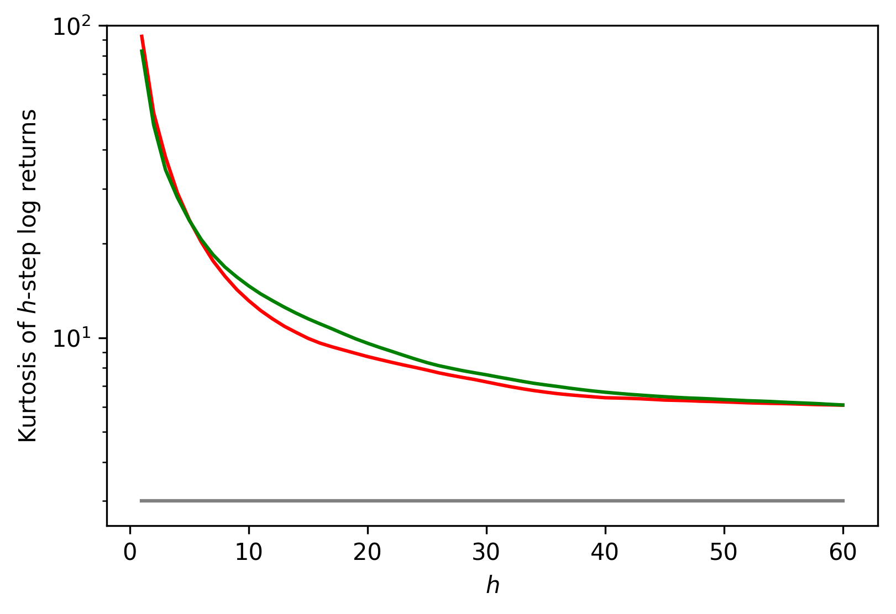
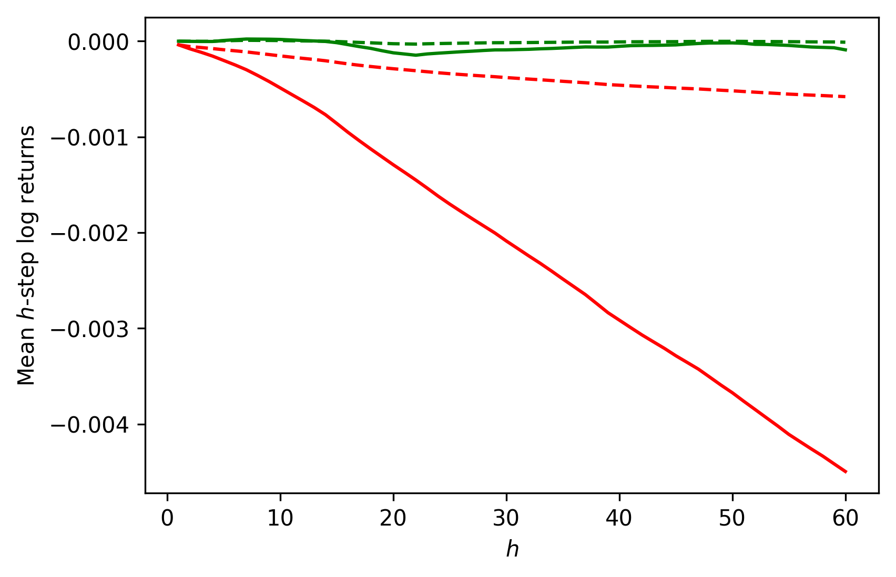
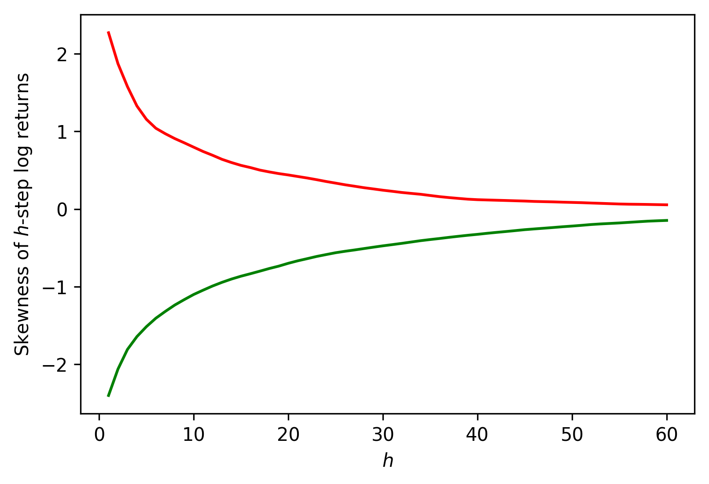
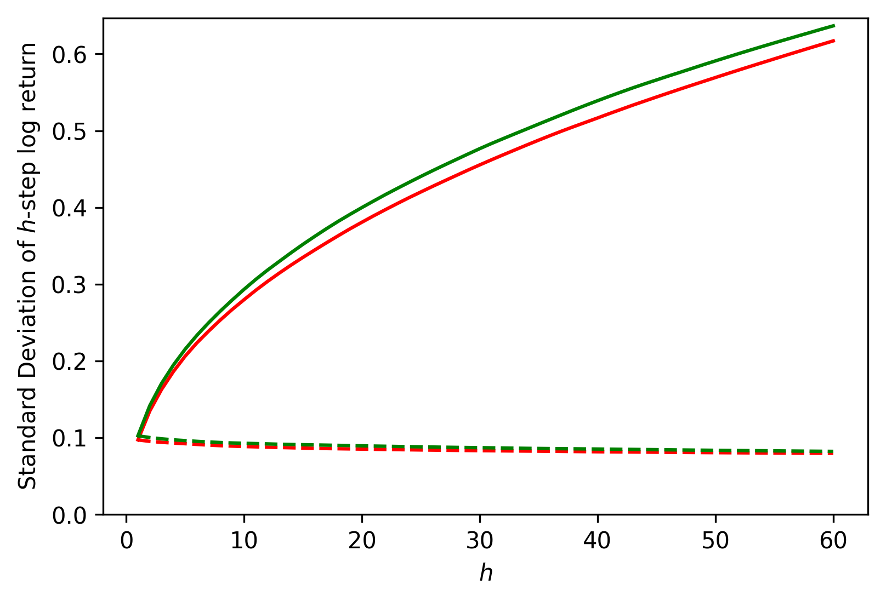
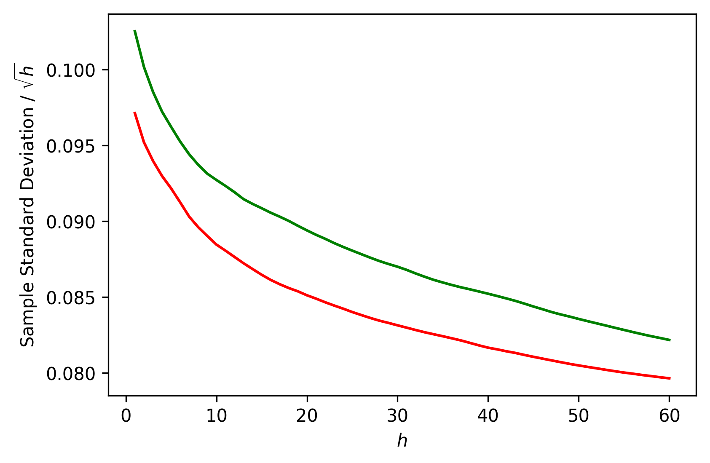

[](http://quantlet.de/)

## [](http://quantlet.de/) **LOBDeepPP_TS_properties** [](http://quantlet.de/)

```yaml


Name of Quantlet: LOBDeepPP_TS_properties

Published in: ''

Description: 'Joint Limit order book ask and bid price predition for multiple predicton horizons with a neural networks. This script analysis and visualizes properties of the limit order book ask and bid prices.'

Keywords: 'Limit order book, finance, forecasting, prediction, order book size, properties, time-series'

Author: 'Marius Sterling'

See also: 'LOBDeepPP'

Submitted:  ''


```















### PYTHON Code
```python

#!/usr/bin/env python3
# -*- coding: utf-8 -*-
"""
Created on Mon May 27 14:49:33 2019

@author: ms
"""
import os
import numpy as np
from scipy.stats import jarque_bera
from scipy.stats import pearsonr as corr
import matplotlib.pyplot as plt
import sys
sys.path.append('..')
from LOB.LOB_keras_train_class import LOB_keras_train_class

# %%
PATH_NN = 'results/nn_model_training/'
MODEL_NAME = 'LOB_keras_model17a'
PATH_NN_MODEL = os.path.join(PATH_NN, MODEL_NAME)

path_save = '.' 
# %% Seting up model

models = [
    sorted([f for f in os.listdir(PATH_NN_MODEL)
            if m.rstrip('.json') + '___' in f and 'model' in f and '.h5' in f],
           key=lambda x: int(x.split("___")[2].replace('model_', '').
                             replace(".h5", "").replace('_TEST', '')))[-1]
    for m in ['params_L10z']]
f = models[0]

f = os.path.join(PATH_NN_MODEL, f)
a = LOB_keras_train_class(os.path.basename(PATH_NN_MODEL))

a.set_model_params(
    os.path.join('LOB/params_files',
                 os.path.basename(f).split('___')[0] + '.json'))

if hasattr(a.model_params, 'set_submodel_weights'):
    del a.model_params['set_submodel_weights']
a.model_params['load_model'] = f
a.model_params['lob_model']["targets_standardize_by_sqrt_time"] = False
a.model_params['lob_model']['log_return_method'] = 'level_1_prices'
a.model_params['lob_model']['pred_horizon'] = [i for i in range(1, 61)]
a.model_params['lob_model']["targets_stacked"] = True
a.model_params['lob_model_file_paths'] = {
    'train': [
        'Data/Matlab/2015-07-06.mat',
        'Data/Matlab/2015-07-07.mat',
        'Data/Matlab/2015-07-08.mat',
        'Data/Matlab/2015-07-09.mat',
        'Data/Matlab/2015-07-10.mat'
    ]
}
a.set_up_model()

# %% Computation of h-step log returns
gen = a.gen['train']
res = [gen[i][1] for i in range(len(gen))]
res = np.concatenate(res, axis=0)
ph = res.shape[1] // 2

# %% Ratio of zero h-step log returns
tmp = (res == 0).mean(axis=0)[::2] * 100
plt.plot(range(1, len(tmp) + 1), tmp, c='green', label='bid')
tmp = (res == 0).mean(axis=0)[1::2] * 100
plt.plot(range(1, len(tmp) + 1), tmp, c='red', label='ask')
plt.xlabel('$h$')
plt.ylabel('Ratio of zero $h$-step returns in %')
plt.ylim([0, 90])
for type in ['pdf', 'png']:
    plt.savefig(f'{path_save}/log_returns_zero_ratio.{type}',
                bbox_inches='tight', dpi=300)
plt.show()

# %% Standard deviation of h-step log returns
tmp = res
plt.plot(range(1, ph + 1), tmp[:, ::2].std(axis=0), c='red', label='ask')
plt.plot(range(1, ph + 1), tmp[:, 1::2].std(axis=0), c='green', label='bid')
plt.ylim([0, tmp.std(axis=0).max() + 0.01])
norm = np.arange(1, ph + 1)**0.5
plt.plot(range(1, ph + 1), tmp[:, ::2].std(axis=0) / norm, linestyle='dashed',
         c='red', label='ask2')
plt.plot(range(1, ph + 1), tmp[:, 1::2].std(axis=0) / norm, linestyle='dashed',
         c='green', label='bid2')
plt.xlabel('$h$')
plt.ylabel('Standard Deviation of $h$-step log return')
for type in ['pdf', 'png']:
    plt.savefig(f'{path_save}/log_returns_std.{type}',
                bbox_inches='tight', dpi=300)
plt.show()
# %% Standard deviation standardized by $h^0.5$ of h-step log returns
tmp = res
norm = np.arange(1, ph + 1)**0.5
plt.plot(range(1, ph + 1), tmp[:, ::2].std(axis=0) / norm, c='red',
         label='ask')
plt.plot(range(1, ph + 1), tmp[:, 1::2].std(axis=0) / norm, c='green',
         label='bid')
# plt.ylim([tmp.std(axis=0).min()*0, tmp.std(axis=0).max() + 0.1])
plt.xlabel('$h$')
plt.ylabel('Sample Standard Deviation / $\\sqrt{h}$')
for type in ['pdf', 'png']:
    plt.savefig(f'{path_save}/log_returns_std_by_time.{type}',
                bbox_inches='tight', dpi=300)
plt.show()

# %% Mean h-step log returns
tmp = res
norm = np.arange(1, ph + 1)**0.5
plt.plot(range(1, ph + 1), tmp[:, ::2].mean(axis=0), c='red', label='ask')
plt.plot(range(1, ph + 1), tmp[:, 1::2].mean(axis=0), c='green', label='bid')
plt.plot(range(1, ph + 1), tmp[:, 1::2].mean(axis=0) / norm,
         linestyle='dashed', c='green', label='bid2')
plt.plot(range(1, ph + 1), tmp[:, 0::2].mean(axis=0) / norm,
         linestyle='dashed', c='red', label='ask2')
plt.xlabel('$h$')
plt.ylabel('Mean $h$-step log returns')
for type in ['pdf', 'png']:
    plt.savefig(f'{path_save}/log_returns_mean.{type}',
                bbox_inches='tight', dpi=300)
plt.show()

# %% Skewness of h-step log-returns
tmp = res
tmp -= tmp.mean(axis=0)
tmp /= tmp.std(axis=0)

plt.plot(range(1, ph + 1), (tmp[:, ::2] ** 3).mean(axis=0),
         c='red', label='ask')
plt.plot(range(1, ph + 1), (tmp[:, 1::2] ** 3).mean(axis=0),
         c='green', label='bid')

plt.xlabel('$h$')
plt.ylabel('Skewness of $h$-step log returns')
for type in ['pdf', 'png']:
    plt.savefig(f'{path_save}/log_returns_skewness.{type}',
                bbox_inches='tight', dpi=300)
plt.show()

# %% Kurtosis of h-step log-returns
tmp = res
tmp -= tmp.mean(axis=0)
tmp /= tmp.std(axis=0)

plt.plot(range(1, ph + 1), (tmp[:, ::2] ** 4).mean(axis=0),
         c='red', label='ask')
plt.plot(range(1, ph + 1), (tmp[:, 1::2] ** 4).mean(axis=0),
         c='green', label='bid')
plt.plot(range(1, ph + 1), np.arange(1, ph + 1) * 0 + 3, c='gray',
         label='zero')
plt.ylim([2.5, 100])
plt.yscale('log')
plt.xlabel('$h$')
plt.ylabel('Kurtosis of $h$-step log returns')
for type in ['pdf', 'png']:
    plt.savefig(f'{path_save}/log_returns_kurtosis.{type}',
                bbox_inches='tight', dpi=300)
plt.show()

# %% Bera Jarque normality statistic

tmp = np.array([jarque_bera(res[:, i])[0] for i in range(res.shape[1])])

plt.plot(range(1, ph + 1), tmp[::2], c='red', label='ask')
plt.plot(range(1, ph + 1), tmp[1::2], c='green', label='bid')
plt.yscale('log')
plt.xlabel('$h$')
plt.ylabel('Jarque-Bera statistic for $h$-step log returns')
for type in ['pdf', 'png']:
    plt.savefig(f'{path_save}/log_returns_normality.{type}',
                bbox_inches='tight', dpi=300)
plt.show()
# %% Correlation

tmp = res
cor_ask = np.array([corr(res[:, i], res[:, 0])[0] for i in
                    range(0, res.shape[1], 2)])
cor_bid = np.array([corr(res[:, i], res[:, 1])[0] for i in
                    range(1, res.shape[1], 2)])

cor_ask_bid = np.array([corr(res[:, i], res[:, 1])[0] for i in
                        range(0, res.shape[1], 2)])
cor_bid_ask = np.array([corr(res[:, i], res[:, 0])[0] for i in
                        range(1, res.shape[1], 2)])


plt.plot(range(0, ph), cor_ask, c='red', label='ask')
plt.plot(range(0, ph), cor_bid, c='green', label='bid')

plt.plot(range(0, ph), cor_ask_bid, c='red', label='ask2',
         linestyle='dashed')
plt.plot(range(0, ph), cor_bid_ask, c='green', label='bid2',
         linestyle='dashed')

plt.xlabel('Time difference $h$')
plt.ylabel('Correlation of returns')
for type in ['pdf', 'png']:
    plt.savefig(f'{path_save}/log_returns_correlation.{type}',
                bbox_inches='tight', dpi=300)
plt.show()

```

automatically created on 2020-03-07